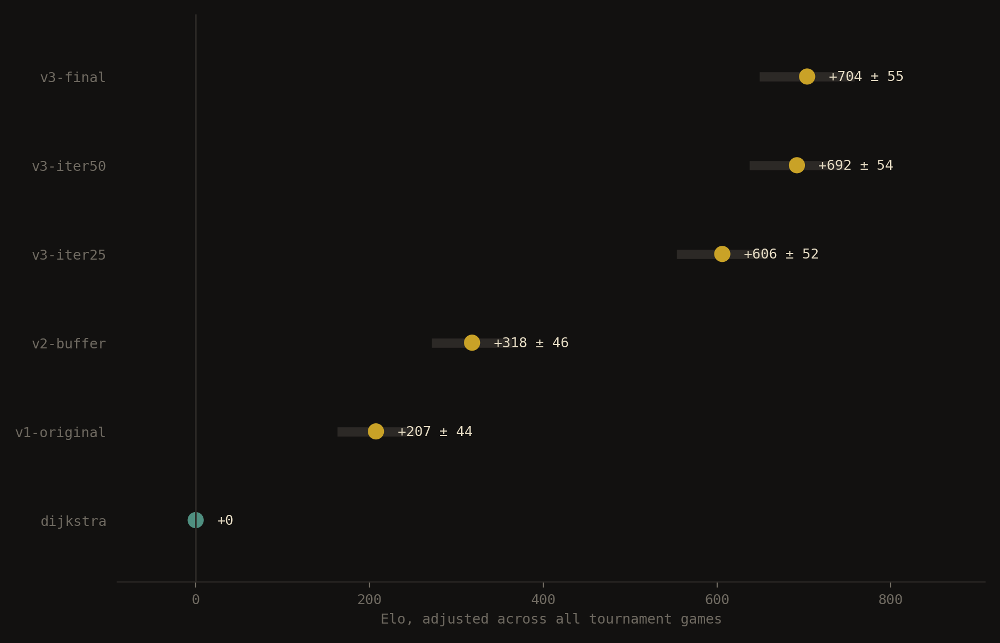
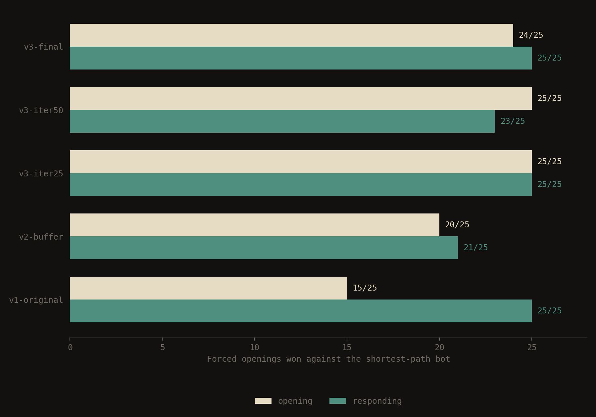
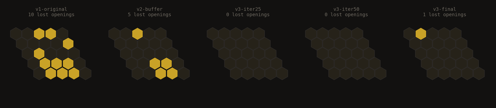

# nash

Nash plays Hex on a `5x5` board and I never taught it anything beyond the rules. There's no opening book for it to memorize, no evaluation function I wrote by hand telling it which positions look good. It started from random weights, played a few thousand games against itself, and everything it knows came out of that process. Against a handwritten shortest-path opponent it wins `49` of the `50` forced openings, and somewhere along the way it figured out on its own that the center of the board is the strongest opening move—which is correct, and which nobody told it. You can play against it [here](https://nash-hex-cf6e7dc1bd23.herokuapp.com/).

The algorithm is AlphaZero, scaled down until it runs on a laptop without melting it. A **Monte Carlo tree search** (MCTS) chooses moves by walking down the game tree and keeping count of what it finds, and a **convolutional network** (CNN) with two outputs guesses who is ahead and where to play, which the search consults every time it reaches a position it hasn't seen before. The reason any of this bootstraps from nothing is that the search always plays better than the network steering it, so the search can be used as a teacher, and a network that has learned from a better teacher then makes the next search better still.

## how any of this is measured

A system that learns by playing itself has no external reference. The obvious thing is to play the current network against an earlier one, and it does work, with the caveat that both of them share the same blind spots and neither will punish the other for having them. A network can improve against every one of its own ancestors and still be walking into a line a human finds in ten minutes, which is not a hypothetical—I know this because it happened to me.

So there is an opponent that shares nothing with the network. In Hex the question *how close am I to winning* is literally a shortest path problem, since the win condition is connectivity between two edges. So build a graph over the `25` cells where your own stones cost `0`, empty cells cost `1` and enemy stones cost `∞`, and the cheapest path between your two home edges is the number of stones you still need. Dijkstra works pretty well for this kind of stuff. The baseline plays the cell maximizing

$$d_{\text{rival}} - d_{\text{mine}}$$

with both distances computed after tentatively placing *its own* stone, which is what makes it defend without anybody writing defense into it. It has no parameters, it never learns, and it is deterministic, so it is a ruler that does not expand.

Determinism, of course, creates its own problem. Two deterministic players produce one game, and repeating it a thousand times still produces yet one single game, so the win rate is a single bit dressed up as a statistic. One fix is to vary the starting positions rather than to add randomness, because you force the first move, then play all `25` of them, and play each with both colours. You have then 50 games, all distinct, and the per-opening breakdown says *which* openings the engine loses from, which an aggregate percentage hides. The first version of the network lost ten openings as first player and none as second, an asymmetry that a single number would have buried.

ELO needs the same care, because it is not transitive. Chaining comparisons between adjacent checkpoints accumulates error in one direction, and the difference between the chained figure and the direct measurement is not small. What `scripts/bayes_elo.py` does instead is fit every player at once against the whole tournament table by maximum a posteriori, with a separate parameter for the first-player advantage and a weak Gaussian prior that keeps an undefeated player from running off to infinity. Standard errors come out of the Hessian.

The advantage term lands at `-46` Elo, which looks like it contradicts the strategy stealing theorem and does not. The first move in these games is *forced*, so the player nominally moving first never chooses an opening, and the opponent gets the first free decision. What that number measures is that a randomly drawn opening is worth slightly less than the first reply to it.

## state representation and network topology

The board is a plain `5x5` matrix, and I fill it with a `1` wherever the player about to move has a stone, a `-1` where the opponent has one, and a `0` on the empty cells. This is the **canonical form**, and the point of it is that the network only ever has to answer one question, which is whether the player to move is winning.

Hex makes that awkward, because one player wins by connecting north to south and the other by connecting east to west, so an identical arrangement of stones means something different depending on whose turn it is. What I do about it is transpose the matrix on the second player's turn, which converts their goal into the first player's goal. Formally, the map applied to a board $B$ when it is the second player's turn is

$$\phi(B) = (-B)^\top$$

and that only works if the geometry survives it, so I checked before relying on it. A cell has six neighbours, at offsets

$$D = \{(0,1),\,(0,-1),\,(1,0),\,(-1,0),\,(-1,1),\,(1,-1)\}$$

Transposition sends $(r,c) \mapsto (c,r)$. Applying it to $D$ shuffles the four orthogonal offsets among themselves and makes the two diagonals trade places, so $\phi(D) = D$ and the adjacency graph is untouched. The transposition turns out to be *the* symmetry that swaps the roles of the two players, which is why composing it with the sign flip gives a canonical form that is exact rather than approximate.

There is a second symmetry, and it is free data. Rotating the rhombus by 180° sends $(r,c) \mapsto (n-1-r,\, n-1-c)$, which negates every offset in $D$, and $D$ is closed under negation. North and south swap, east and west swap, and neither player's objective changes. Every training example therefore counts twice, and the same rotation applied to $\pi$ keeps the pair coherent. I verified it on two thousand random playouts before trusting it, because a broken augmentation poisons the dataset silently and that is worse than not augmenting at all.

The network is small. Three convolutional layers with `16` `3x3` filters each and a **ReLU** between them, because stacking convolutions with nothing in between leaves you with a composition of linear maps, which is still one linear map. The receptive field after $L$ layers of kernel size $k$ is

$$R = 1 + L(k-1)$$

so three layers of `3x3` reach $R = 7$, wide enough to cover a `5x5` board from any cell on it. On `11x11` it would not be, and that matters more in Hex than it would in image classification, since whether a connection between two edges is viable can depend on a stone at the far end of the board.

The trunk then splits into two heads. The **value head** compresses the board into one number through `tanh`, where $-1$ means the player to move is certainly losing. The **policy head** produces one number per cell, with the occupied cells set to $-\infty$ before the softmax so they come out at exactly zero afterwards, since $e^{-\infty} = 0$ leaves the remaining mass to renormalise itself over the legal moves.

## tree search and the exploration term

A plain Monte Carlo tree search evaluates a position by playing random games from it until somebody wins. It does work, and it is extremely noisy, because a random continuation from a position that is objectively winning still loses about half the time.

The rule that decides which branch to walk down is **UCB1**, and it did not come from game playing at all.

$$\frac{W}{N} + c\sqrt{\frac{\ln N_{\text{parent}}}{N}}$$

The idea is that you stop comparing options by the average payout you have observed and start comparing them by the highest value they could plausibly have. A child visited `3` times has a wide margin of error, so its optimistic ceiling stays high even when the average is mediocre, whereas a child visited `300` times has a narrow one. And then the useful consequence, which is that a node can win the comparison either because it genuinely is good or because you have barely looked at it and the uncertainty is doing the work. Exploitation and exploration both fall out of one rule. The square root is the width of that confidence interval, decaying as $O(1/\sqrt{N})$, and the logarithm is what keeps the bonus growing slowly enough that the search eventually commits to something.

With a network attached the random games disappear. When the search reaches an unexpanded position it queries the network once and gets both answers at the same time. The value replaces the rollout. The policy becomes a prior on every child, so the first visits head towards the moves the network considers worth examining instead of spreading evenly over `25` cells that look identical to a search with no information. The rule that combines them is **PUCT**, where the $P$ is that prior.

$$Q(s,a) + c \cdot P(s,a) \cdot \frac{\sqrt{N(s)}}{1 + N(s,a)}$$

Reading the shape rather than the symbols helps here. At $N(s,a) = 0$ the term $Q$ is empty and the prior is the only information in existence, so the prior decides alone. As visits accumulate the denominator grows and the prior's contribution decays as $O(1/N(s,a))$ while the empirical average takes over, so the intuition dissolves at the rate the search finds things out on its own. A network that was confidently wrong can therefore be overruled, at least in principle. The section after next is about the arithmetic under which it cannot.

## supervision without a dataset

Training the value head is easy enough. You play a game to the end, and every position where the eventual winner was the one to move gets labelled $z = +1$ while the others get $z = -1$. That result is the only thing in the entire system that does not come out of the network.

The policy head is the "good" one, because training it the usual supervised way would require knowing the correct move, and nobody knows the correct move in Hex.

Well, the search has already produced one without being asked to. After a few hundred simulations the visits are not spread evenly across the children, they have piled up on whichever moves the search found worth pursuing, so normalising the counts

$$\pi(a) = \frac{N(s,a)}{\sum_b N(s,b)}$$

gives a distribution over the same `25` cells the policy head outputs. And $\pi$ is better than the network's own $p$, because it has a few hundred simulations of real lookahead baked into it. So the network gets trained to predict, instantly, the conclusion it would have arrived at if it had stopped and thought about it.

$$L = (z - v)^2 - \pi^\top \log p$$

There are squared error on the left and cross entropy on the right. There is one thing about that second term that took me a while to understand, which is that a cross entropy measured against some distribution can never drop below the entropy of that distribution,

$$H(\pi, p) \ge H(\pi)$$

with equality only when $p = \pi$. A flat policy over `25` cells has $H = \ln 25 \approx 3.22$, so during the early iterations the loss is *physically incapable* of going below that number however well the network learns. Seeing it drop under `3.22` later on tells you something else, which is that the labels themselves have become sharper.

The consequence though is that the loss and the playing strength can move in opposite directions. In the final run the policy loss bottoms out around iteration `22` and then climbs for the remaining seventy-eight, which looks like a regression and is the opposite of one: the search is spreading its visits over more cells, $H(\pi)$ has gone up, and the floor has risen underneath a network that is playing considerably better. Reading the loss curve on its own would have led to exactly the wrong conclusion, so there are two other numbers logged every iteration, described below.

## the weird exploration collapse

There is no bug in this section. Every line of code was doing precisely what I told it to do.

The symptom showed up from the outside: a friend noticed a simple sequence that beat the engine every single time. Let the engine make its opening, then steadily fill the bottom row from left to right. Across a dozen games, it never blocked—even with an obvious move available that would both stop the threat and improve its own position. 

Bumping the simulation budget from `500` to `2225` suddenly made it block. One simulation lower, it ignored the threat completely. That is, in fact, not a coincidence.

When a possible move (a child node) has an initial probability (prior $P$) and zero previous visits, its exploration bonus is calculated as $c \cdot P \cdot \sqrt{N}$, where $c$ is the exploration constant and $N$ is the total simulation count. The engine only looks at that move for the first time when this bonus exceeds the score ($Q$) of the current favorite move. That means the minimum budget required to even consider it is:

$$N > \left(\frac{Q}{c\,P}\right)^{2}$$

Plugging in the actual values shows what went wrong. With a flat noise mixing of $\lambda = 0.4$ spread across `25` board cells, every legal move got a baseline floor prior of `0.016`. With the exploration constant set to `1.0`, a `200`-simulation search yields $\sqrt{199} \approx 14.1$. The resulting exploration term for a floored cell maxes out at `0.226`. The moment the network's evaluation head becomes more confident than `0.226`, any cell sitting at the baseline is completely ignored. Not rarely—never.

Training logs showed this collapse happening almost immediately, at iteration `1`. At iteration `0`, the network's median confidence—measured as $|v|$ across a fixed test set—was `0.2299`, and every cell in the opening position received at least one visit. By iteration `1`, confidence rose to `0.2905`. Instantly, `23` of the `25` cells dropped to zero visits, where they remained for the next 98 iterations. Toward the end, $|v|$ reached `0.998`, meaning the engine would have needed around `3900` simulations just to glance at a floored cell.

The engine was never evaluating the defensive block and deciding against it. It simply never looked at the square. A single visit would have been enough to spot the danger—the resulting $-1$ loss signal would have propagated back up and fixed the decision. In fact, an untrained network blocked the sequence easily because its raw randomness distributed visits everywhere. Premature confidence was the real failure mode.

Fixing this took three separate changes: swapping flat mixing for Dirichlet noise so a few cells actually cross the threshold per game, bumping $c$ from 1.0 to 2.5 to scale with the priors, and forcing random opening moves during self-play so the training data doesn't get trapped in shared blind spots.

A controlled test over six training iterations from scratch shows the difference:

| Configuration | Effective moves | Median $\lvert v \rvert$ | Root cells visited |
|---|---|---|---|
| Original setup | `13.4` | `0.53` | `16` of `25` |
| With all three fixes | `16.4` | `0.32` | `25` of `25` |

Here, **effective moves** represents the number of choices the network actively weighs (calculated via entropy, $\exp H(p)$), while **median $|v|$** reflects how strongly it insists on its evaluation. Both metrics offered far more insight than training loss alone: the original run ended with a narrow `2.71` effective moves and extreme certainty at `0.998`, while the corrected setup maintained a healthy `7.58` effective moves at `0.949`.

## two sign errors

Before any of that there were two ordinary bugs, and neither of them crashed anything either.

The first was in the canonical form. On the second player's turn the network looks at a transposed board, so the policy it hands back is indexed in transposed coordinates, and I was reading it with indices taken from the real board. For half of every game the priors were scrambled.

The second was in the backup. A node stores its value from the point of view of whoever made the move that led to it, and the network hands back its value from the point of view of whoever moves next, and those are opposite people. Terminal nodes were unaffected, since they return a hardcoded $+1$, so the search kept finding mate in one perfectly well, and that is precisely why the first test I wrote reported the sign as correct and sent me looking somewhere else for a day.

The better the value head became at judging positions, the more consistently the search picked the wrong side of them. The untrained network was winning because its value output was noise, and noise at least has no direction to it.

## results

Three configurations, each `5x5`, Adam at `0.001`, temperature sampling over the first `14` moves.

| | iterations | games / iter | sims | replay buffer | root noise | $c$ |
|---|---|---|---|---|---|---|
| **v1** | `30` | `50` | `200` | none | flat, $\lambda = 0.4$ | `1.0` |
| **v2** | `100` | `50` | `200` | `10` iterations | flat, $\lambda = 0.4$ | `1.0` |
| **v3** | `100` | `50` | `600` | `10` iterations | Dirichlet, $\alpha = 1.0$ | `2.5` |

v2 adds the replay buffer and the 180° augmentation. v3 adds Dirichlet noise, the exploration constant, the random self-play openings and the larger simulation budget. The final run takes about an hour and a quarter on twelve cores, with self-play accounting for essentially all of it; training the network is under a second per iteration, which is why the buffer is free and the simulation count is not.

`750` tournament games, all `25` forced openings played with both colours between every pair, `200` simulations and $c = 1.0$ at inference for everybody so the comparison measures the networks and not the settings.

| | vs baseline | Elo |
|---|---|---|
| v1 | `40 / 50` | `+207 ± 44` |
| v2 | `41 / 50` | `+318 ± 46` |
| v3 at iteration `25` | `50 / 50` | `+606 ± 52` |
| v3 at iteration `50` | `48 / 50` | `+692 ± 54` |
| v3 final | `49 / 50` | `+704 ± 55` |

Reading it honestly, three things.

The gap from v1 to v3 is about `500` Elo and is real. The gap from v2 to v3 is `386` of those, and the buffer and augmentation account for `111`, so the exploration fix is where nearly all of it lives.

The three v3 checkpoints are not distinguishable from each other. Whatever the run learns, it has learned by iteration `25`, and the remaining seventy-five buy nothing measurable. Gating would be the thing to try here.

And the baseline is spent. v3 wins `49` or `50` of `50` regardless of which checkpoint you pick, so it no longer separates the good networks from the very good ones. It measures the v1 to v3 story fine and it will not measure the next one.

The openings each network still loses as first player, which is the same data with the aggregate removed:

## layout

    nash/
    ├── hexzero/
    │   ├── board.py       # rhombus, union-find with 4 virtual edge nodes
    │   ├── mcts.py        # PUCT, Dirichlet noise at the root
    │   ├── network.py     # shared trunk, value head, policy head
    │   ├── selfplay.py    # game generation, 180° augmentation and training step
    │   ├── probe.py       # policy entropy and value confidence diagnostics
    │   ├── shortest_path_bot.py # the name is pretty descriptive
    │   ├── visualize.py   # terminal heatmap of the opening policy
    │   └── cli.py         # interactive terminal cli
    ├── scripts/
    │   ├── train.py       # self-play loop, parallel, writes checkpoints and logs
    │   ├── opening_suite.py
    │   ├── tournament.py  # round robin over forced openings
    │   ├── bayes_elo.py   # maximum a posteriori ELO fit
    │   └── figures.py
    ├── web/
    │   ├── app.py         # FastAPI, stateless
    │   └── static/        # pixel board on a canvas
    ├── tests/
    └── results/

Notes:
- Win detection runs on union-find with `4` virtual nodes, one per edge. Every stone joins its neighbours of the same colour and any edge node it touches, so asking whether white has won amounts to asking whether the north and south nodes ended up in the same set. With path compression and union by size that is $O(\alpha(n))$ per query instead of a search over the board, which matters once the tree calls it hundreds of thousands of times.
- The first version that worked took `26s` to generate `5` games, and the profiler put `17` of those inside `copy.deepcopy`. Writing a `copy` method that knows there is exactly one array and two union-find structures to duplicate brought it down to `9.5s`. My guess about where the time was going, before I ran the profiler, was wrong.
- Self-play parallelises across processes without any coordination, since the network is fixed for the duration of an iteration. Each worker pins itself to one thread, because PyTorch will otherwise have every process trying to use every core and the result is slower than running it serially.
- `ROOT_MIX` defaults to the training value, so the web and the CLI pass `root_mix=0.0` explicitly. A default that is right for training and wrong for play is a good way to serve a weaker engine than the one you measured.
- The web version holds no session state. That is, the browser keeps the list of moves and sends it with every request, and the server replays the game from scratch before answering.

## running it

    pip install -r requirements.txt
    py -3.13 -m scripts.train                                  # writes checkpoints/ and results/
    py -3.13 -m scripts.opening_suite checkpoints/nash.pt      # 50 games against the baseline
    py -3.13 -m scripts.tournament "v3=checkpoints/nash.pt"    # round robin, writes the tournament csv
    py -3.13 -m scripts.bayes_elo --anchor dijkstra
    py -3.13 -m scripts.figures
    py -3.13 -m uvicorn web.app:app                            # localhost:8000

## what is missing

- **Gating**, so a new checkpoint replaces the current one only after clearing a threshold against it. The plateau after iteration `25` is what this would address, and there is now a measurement precise enough to tell whether it worked.
- **A harder opponent.** The shortest-path baseline is saturated. The obvious replacement is an **exact solver**, since `5x5` Hex is small enough for alpha-beta with memoisation over the same union-find, which would let the engine be measured against perfect play instead of against something else I also wrote.
- **The value head saturates.** Median $|v|$ ends at `0.949`, and with targets that are exactly $\pm 1$ and no draws in Hex there is nothing pulling it back. Label smoothing or a smaller weight on the value term are both one line and neither has been tried.
- **Confidence intervals on the head-to-head numbers.** `50` games per pairing gives Elo error bars around `±50`, which is wide enough that the three v3 checkpoints are indistinguishable, and that is a statement about the sample size as much as about the networks.
- Then batched network evaluation, and residual blocks, which three layers on `5x5` have no need for and `11x11` would.

## where this came from

For the tree search, the survey by Browne et al., *A Survey of Monte Carlo Tree Search Methods* (2012), and for UCB1 and the bandit framing underneath it, Auer, Cesa-Bianchi and Fischer. For the self-play loop, PUCT and the Dirichlet noise that I should have read more carefully the first time, Silver et al., *Mastering the game of Go without human knowledge* (2017). For the hyperparameter sweep that convinced me outer iterations dominate everything inside them, Wang et al., *Hyper-Parameter Sweep on AlphaZero General* (2019), which also happens to run on `5x5` boards. Piet Hein invented Hex in 1942, and John Nash later proved that the first player has a winning strategy using a strategy stealing argument. The engine is named after him.

A longer writeup in Spanish is on the way, structured as an Obsidian vault like the one I put together for [the neural network](https://linkyless.github.io/neural-network-notes). It will go [here](https://linkyless.github.io/nash-hex-notes/) once it exists.
