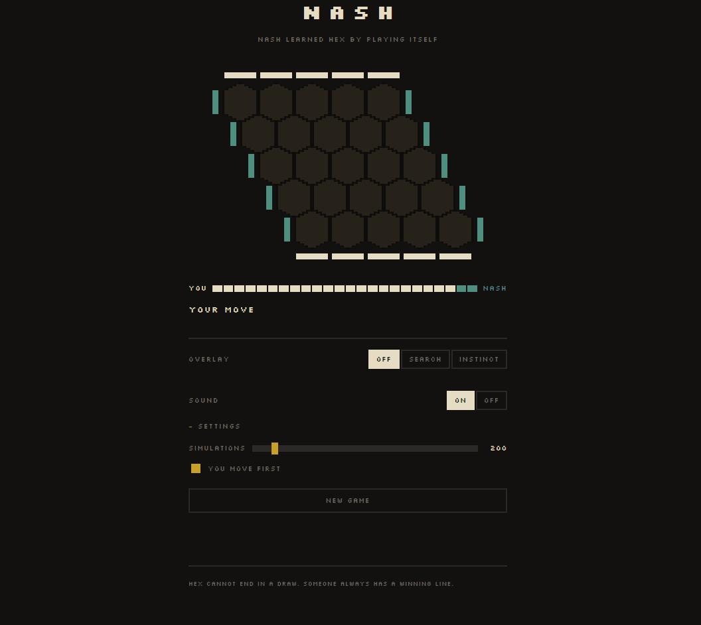
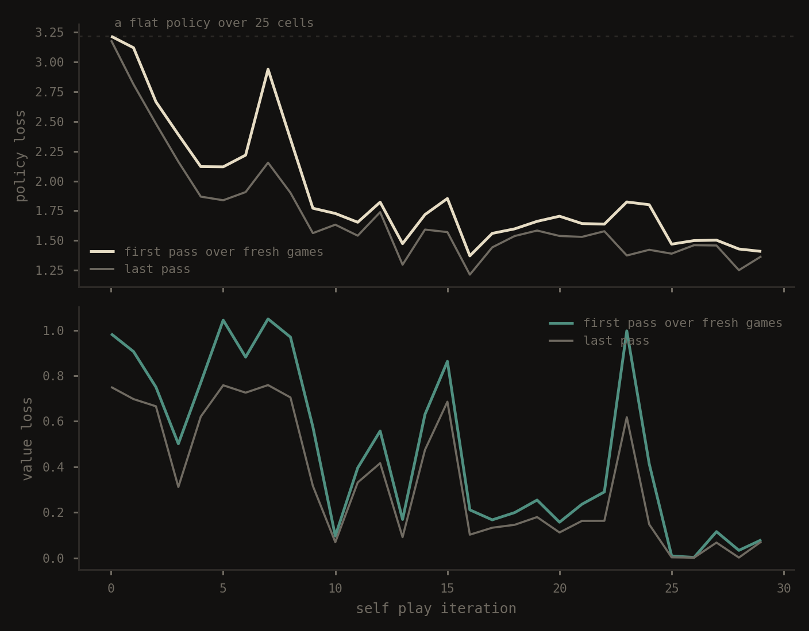
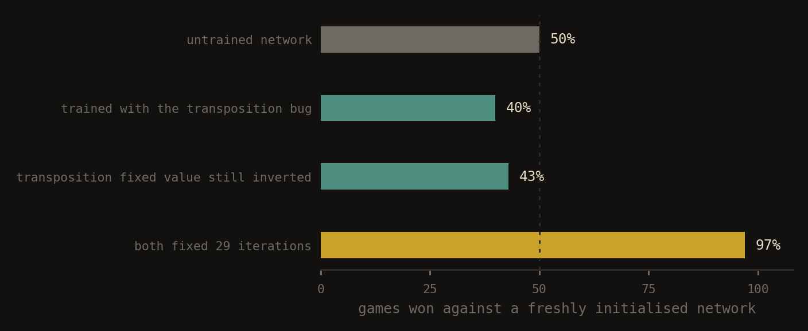
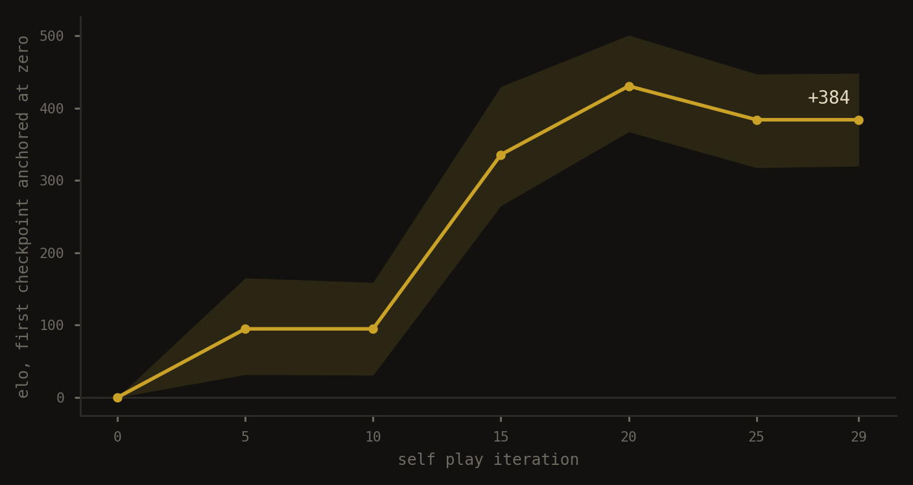
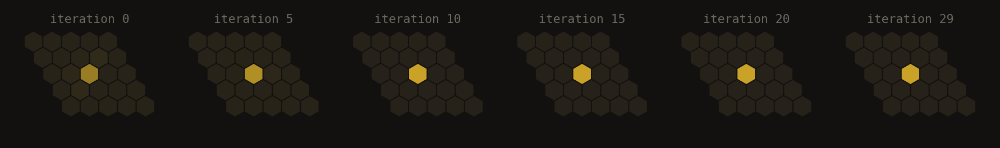

# nash

Nash plays Hex on a 5x5 board and it beats its own first iteration 97 games out of 100. Nobody taught it anything about the game beyond the rules, so there was no opening book for it to memorise and no evaluation function that I wrote by hand telling it which positions are good. It started from random weights, played fifteen hundred games against itself, and everything it knows came out of that. You can play against it [here](#).

The algorithm is AlphaZero, scaled down until it runs on a laptop. There are in fact two pieces doing the work. One of them is a Monte Carlo tree search (MCTS), which is what actually chooses the move, by walking down the game tree and keeping count of what it finds. Now that's kind of cool, but the other is a convolutional network with two outputs. One of them guessing who is ahead and the other guessing where to play, which is nice, and the search consults it every time it reaches a position it has not seen before. The reason any of this bootstraps from nothing is that the search always plays better than the network steering it, so the search can be used as a professor for the network, and a network that has learned from a better professor then makes the next search better still.

## the board and the network

The board is a plain `5x5` matrix, and I fill it with a `1` wherever the player about to move has a stone, a `-1` where the opponent has one, and a `0` on the empty cells. This is called the canonical form, and the point of it is that the network only ever has to answer a single question, which is whether the player to move is winning. Had I used a fixed sign per colour it would have needed to learn that question twice, once from each side, and every training game would have been worth half of what it is worth now. Hex makes this awkward, because the two players are not trying to do the same thing. One of them wins by connecting the north edge to the south edge, and the other one wins by connecting east to west, so an identical arrangement of stones means something completely different depending on whose turn it is. What I do about it is transpose the matrix whenever it is the second player's turn, which converts their goal into the first player's goal. That only works if the geometry of the board survives being transposed, so I checked before relying on it. A cell in Hex has six neighbours, sitting at offsets `(0,±1)`, `(±1,0)`, `(-1,+1)` and `(+1,-1)`. Transposing sends `(r,c)` to `(c,r)`, and applying that to the six offsets shuffles the four orthogonal ones among themselves and makes the two diagonals trade places, so the set you end up with is the set you started with. The transposition turns out to be exactly the symmetry that swaps the roles of the two players, which is why combining it with the sign flip produces a canonical form that is exact. What a good invariant, is it?

The network is sort of small. It has `3` convolutional layers with `16` `3x3` filters each, and a ReLU in between them, because stacking three convolutions with nothing between them leaves you with a composition of three linear maps, which is still one linear map, and the second and third layers would be incapable of detecting anything the first one missed. After three layers of `3x3` the called receptive field is `1 + 3·2 = 7` (with the receptive field formula), which is wide enough to cover a `5x5` board from any cell on it. On an `11x11` board it would not be, and that matters far more in Hex than it would in something like image classification, since whether a connection between two edges is viable can depend on a stone sitting at the far end of the board.

After the trunk the network splits into two heads that share everything before them. The value head compresses the whole board into one number and passes it through `tanh`, so it lands somewhere between minus one and plus one, with minus one meaning the player to move is certainly losing. The policy head produces one number per cell. Before the softmax I set the occupied cells to minus infinity, which makes them come out at exactly zero probability afterwards, and the remaining probability renormalises itself over the legal moves without any extra work.

## the search, mcts, and so

A plain Monte Carlo tree search evaluates a position by playing random games from it until somebody wins, and counting how often each side came out ahead. It does work, and it is extremely noisy, because a random continuation from a position that is objectively winning still loses about half the time. The rule that decides which branch to walk down is called UCB1 (Upper Confidence Bound), and it is worth pointing out that it did not come from game playing at all. It comes from the multi armed bandit problem, the one where you have several slot machines with unknown payouts and a limited number of coins to spend on them. I'd mention it at the end of the document. Now this is the formula for the UCB1:

$$\frac{W}{N} + c\sqrt{\frac{\ln N_{\text{parent}}}{N}}$$

The idea behind it is that you stop comparing your options by the average payout you have observed, and start comparing them by the highest value they could plausibly have. A child you have visited three times, for instante, has a very wide margin of error around its average, so its optimistic ceiling stays high even when the average itself is mediocre, whereas a child you have visited three hundred times has a narrow one. And then the useful consequence of that, which is that a node can win the comparison in two entirely different ways, either because it genuinely is good, or because you have barely looked at it and the uncertainty is doing all the work. Exploitation and exploration both fall out of one rule and nobody had to write them separately. The square root in the formula is the width of that confidence interval, and the logarithm is what lets the exploration bonus keep growing forever while growing slowly enough that the search eventually commits to something.

One thing that I found cool is that the random games disappear entirely because when the search arrives at a position it has not expanded before, it queries the network once and gets both answers back at the same time. The value takes the place of the random rollout, which is faster and much less noisy. The policy becomes a prior attached to every child, so the first visits head towards the moves the network considers worth examining, instead of being spread evenly over twenty five cells that all look identical to a search with no information. The rule that combines the two is called PUCT, and the P is that prior.

$$Q(s,a) + c \cdot P(s,a) \cdot \frac{\sqrt{N(s)}}{1 + N(s,a)}$$

It helps to read the shape of that expression rather than the symbols. When a child has no visits at all, `Q` is empty and the prior is the only information in existence, so the prior decides. As visits accumulate the denominator grows and the prior's contribution shrinks while the empirical average takes over, so the network's intuition dissolves gradually as the search finds things out on its own. If the network was confidently wrong about a move, the search is allowed to overrule it, and that is the property that keeps the system from locking itself into its own mistakes.

## where the training labels come from

Training the value head is easy enough. You play a game to the end, you look at who won, and every position where the eventual winner was the one to move gets labelled plus one while all the others get minus one. It is worth noticing that this result is the only thing in the entire system that does not come out of the network. It is a fact about the rules of the game.

The policy head is the interesting one, because training it the usual supervised way would require knowing the correct move for a position, and nobody knows the correct move in Hex. There is no dataset of labelled positions and there is no way to produce one.

Well, the search has already produced one without being asked to. When it finishes a few hundred simulations from a position, the visits are not spread evenly across the children, they have piled up on whichever moves the search found worth pursuing. Normalise those counts and you get a distribution over exactly the same twenty five cells that the policy head outputs, so the two are directly comparable. And that distribution is better than the network's own guess, because it has a few hundred simulations of real lookahead baked into it that the raw guess never had.

So the network gets trained to predict, instantly, the conclusion it would have arrived at if it had stopped and thought about it. The search always plays better than the network steering it, so the gap between them never closes, so there is always something left to teach.

$$L = (z - v)^2 - \pi^\top \log p$$

The first term is a squared error between the predicted value and the actual result of the game. The second is the cross entropy between the policy the network produced and the visit distribution the search produced. There is one thing about that second term that took me a while to understand, which is that a cross entropy measured against some distribution can never drop below the entropy of that distribution. A completely flat policy over twenty five cells has entropy `ln 25 ≈ 3.22`, so during the early iterations, when the search has no idea what it is doing and spreads its visits evenly, the loss is physically incapable of going below that number however well the network learns. Seeing it drop under 3.22 later on tells you something else, which is that the labels themselves have become sharper.

## there were sign errors

Neither of them crashed anything, which is the whole difficulty with this kind of code. The program ran, the loss curve went down nicely, and the engine got weaker with every iteration.

What exposed them was putting a trained network up against a freshly initialised one and counting the results. `40%`. Training had been actively damaging it since the very first iteration, and the loss curve had been reporting progress the entire time.

The first one was in the canonical form. On the second player's turn the network is looking at a transposed board, so the policy it hands back is indexed in transposed coordinates, and I was reading it with indices taken from the real board. For half of every game the priors were scrambled, and a prior that is wrong in a consistent way does more damage than a random one, since the search will average noise out over enough visits and has no way to average out a systematic error.

The second one was in the backup. My convention was that a node stores its value from the point of view of whoever made the move that led to it, and the network hands back its value from the point of view of whoever moves next, and those are opposite people. Terminal nodes were unaffected, since they return a hardcoded plus one, so the search kept finding mate in one perfectly well, and that is precisely why the first test I wrote reported the sign as correct and sent me looking somewhere else for a day.

The consequence is worth stating plainly. The better the value head became at judging positions, the more consistently the search picked the wrong side of them. The untrained network was winning because its value output was noise, and noise at least has no direction to it.

## results

`30` iterations, `50` self-play games in each of them, `200` simulations per move, `5` training passes over each batch of games, and Adam with a learning rate of `0.001`. That comes to a bit under `2h` on a laptop with an RTX 3050, and the GPU spent most of that time idle, because the bottleneck is the tree search running in interpreted Python rather than anything the network does.

The final checkpoint beats the first one 97 games out of 100, measured over `50` paired openings, where each random starting position is played twice with the colours swapped so that neither side benefits from having drawn a lucky one. That works out to roughly `600` Elo.

The chained ladder in that figure adds up to more than 1100, and the direct measurement is the one I trust. I guess Elo is not transitive between engines, so measuring only adjacent pairs and adding the differences together accumulates error in a single direction. The curve is still worth showing though, because its shape carries information even where the final value is inflated.

That shape dips between iteration 10 and 15, and the loss curves explain why. The value loss sits at almost exactly zero throughout that stretch, which sounds like the network having solved its problem and means the opposite. What it means is that the self-play games had collapsed into near identical repetitions of one another, so predicting the winner had become trivial and there was nothing left in the data worth learning. The network was training on a narrower and narrower slice of the game and paying for it in general strength. Somewhere around iteration 21 the temperature sampling opens up a different line, the value loss explodes back upwards, and the ladder starts climbing again.

The same collapse shows up from another angle. What follows is actually the visit distribution over an empty board, one panel per iteration, all of them normalised against the same peak so they can be compared to each other.

Iteration zero spreads two hundred simulations across twenty five cells and learns almost nothing from any of them. By the end nearly all of them land on a single square. That concentration is what makes the search strong and it is also what starves the training data of variety, and both of those are happening at the same time.

## structure

    nash-hex/
    ├── hexzero/
    │   ├── board.py       # HexBoard, win detection, canonical form
    │   ├── ufds.py        # union-find with path compression
    │   ├── mcts.py        # Node and the PUCT search
    │   ├── network.py     # shared trunk, policy head, value head
    │   ├── selfplay.py    # game generation and the training epoch
    │   ├── arena.py       # head to head matches with paired openings
    │   ├── visualize.py   # terminal heatmap of the opening policy
    │   └── cli.py         # two humans, one terminal
    ├── scripts/
    │   ├── train.py       # the self-play loop, writes checkpoints and logs
    │   ├── ladder.py      # plays the checkpoints against each other
    │   └── plots.py       # reads the logs, draws the figures
    ├── web/
    │   ├── app.py         # FastAPI, stateless, replays the move list
    │   └── static/        # pixel board on a canvas
    ├── tests/
    └── results/

Win detection runs on union-find with four virtual nodes, one for each edge of the board. Every stone gets joined to its neighbours of the same colour and to any edge node it happens to touch, so asking whether white has won amounts to asking whether the north node and the south node ended up in the same set. That is nearly constant time per move instead of a search over the whole board, which matters once the tree starts calling it hundreds of thousands of times.

The first version that worked took twenty six seconds to generate five games, and the profiler put seventeen of those seconds inside `copy.deepcopy`. Writing a `copy` method that knows there is exactly one array and two union-find structures to duplicate brought it down to nine and a half. My guess about where the time was going, before I ran the profiler, was wrong.

The web version holds no session state at all. The browser keeps the list of moves and sends the whole thing with every request, and the server replays the game from scratch before it answers, which means undo and sharing a position both come for free.

## running it

    pip install -r requirements.txt
    py -3.13 -m scripts.train              # a couple of hours, writes checkpoints/
    py -3.13 -m scripts.ladder             # plays the checkpoints against each other
    py -3.13 -m scripts.plots              # draws everything into results/
    py -3.13 -m uvicorn web.app:app        # play against it at localhost:8000

If you are using another version of python, you must know what to do.

## what is missing

The clearest thing the data asks for is a replay buffer holding several iterations of games instead of only the most recent one, which is what would have prevented the collapse around iteration 12. After that, more than eight moves of temperature sampling, since eight out of twenty five is not much variety. Then batched network evaluation, so that several self-play games can advance in parallel and the GPU has something to do. And residual blocks, which three layers on a 5x5 board have no need for and an 11x11 board would.

## where this came from

For the tree search, the survey by Browne et al., *A Survey of Monte Carlo Tree Search Methods* (2012), and for UCB1 and the bandit framing underneath it, Auer, Cesa-Bianchi and Fischer. For the self-play loop and PUCT, Silver et al., *Mastering the game of Go without human knowledge* (2017). Piet Hein invented Hex in 1942, and John Nash later proved that the first player has a winning strategy, using a strategy stealing argument short enough to fit inside a paragraph. The engine is named after him.

Most of this was worked through in conversation with Claude, which in practice meant being asked what I thought before being told anything.

A longer writeup in Spanish is on the way, structured as an Obsidian vault like the one I put together for [the neural network](https://linkyless.github.io/neural-network-notes). It will go [here](#) once it exists.
